# MicroSpringboot

This project is the development of a Java Web server as part of an academic workshop. Below, the objectives and main characteristics of the project are described, as well as the steps for deployment on AWS on an EC2 instance.

## What does it need to run??
### Dependencies
> - Java 21
> - mvn 3.3.0
### How to run it
- First compile the project using
```bash
   mvn clean install
```
- Then from the project root, run the following command:
```bash
   java -cp target/classes co.edu.escuelaing.MicroSpringBoot
```
## Workshop Objectives

- **IoC Framework**: Include an inversion of control framework to allow the construction of Web applications from POJOS (Plain Old Java Objects).
- **Example application**: Create a sample web application using the server.
- **Request handling**: Enable the handling of multiple non-concurrent requests.
- **Minimal prototype**: Demonstrate Java's reflective capabilities by allowing to load a bean (POJO) and derive a web application from it.

## Project description
### Annotations
- The annotations GetMapping, RequestParam and RestController were created
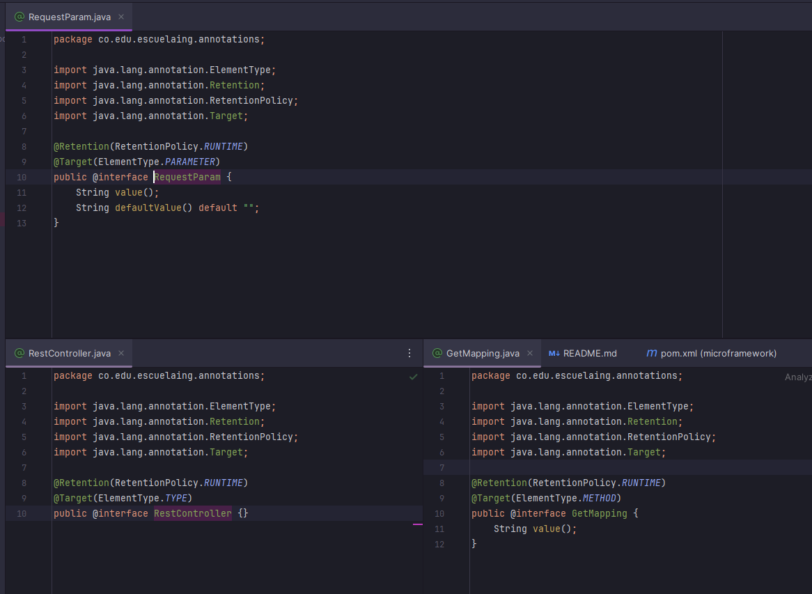
- A class was declared as @interface.
- @Retention was used so that the annotation is maintained while the program is running.
- @Target was used to know which element the annotation will mark.
- Values were defined where necessary, and in one case a default value was defined in case the other value is not found.

### Controllers (POJO)
- The following controllers were created.
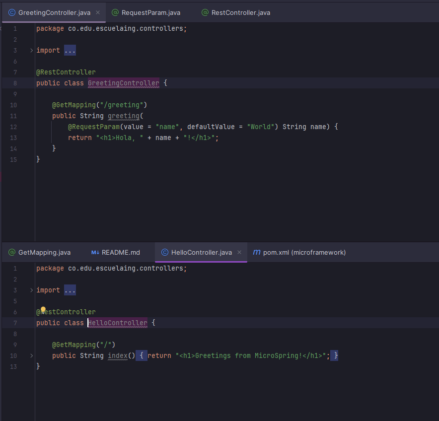
- Controllers were marked with the @RestController annotations
- Methods were marked with the @GetMapping annotation and an internal value that defines the route.
- A parameter was marked with @RequestParam to obtain the value of that parameter and declare a default value in case it is not found.

### HttpServer
- It stores routes, with their respective methods and instances of those marked with the @RestController and @GetMapping labels
- This class creates the connection with the browser that wants to make a request.
- It receives requests, extracts parameters and executes the corresponding methods.
- It registers methods and instances of the controllers.
- - It search static files if the route is not register.
### MicroSpringBoot
- Here the service of our Micro SpringBoot is started and the necessary operations for IoC are performed
> 1. 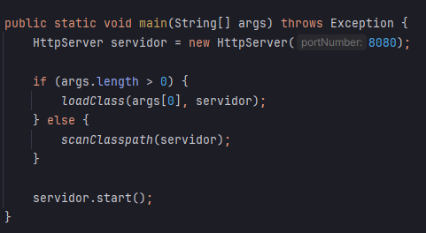
>     - In the main method it starts the http server and follows two paths: in case a controller has been specified, it loads it directly; if not, it scans the classPath.
> 2. 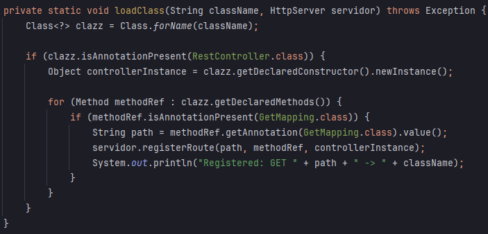
>     - This loads a controller, verifying that the specified class contains the RestController annotation, creating an instance of it and iterating over its methods looking for the getMapping annotation; upon finding it, it obtains the route value and registers it in the server.
> 3. 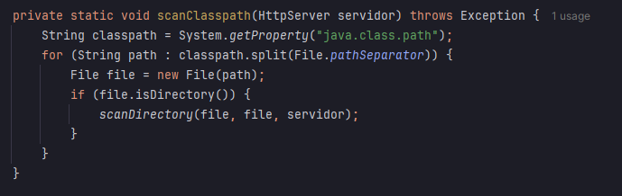
>     - The method scans the classpath entirely; when entering it validates if it is a directory and if so begins its scan.
> 4. 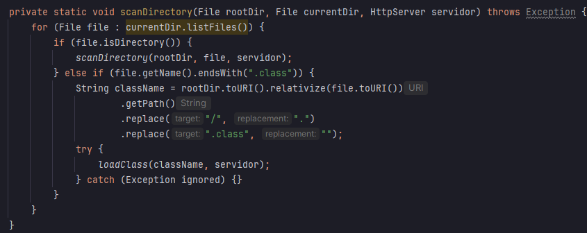
>     - It scans the directory recursively until it finds files; upon finding them it formats the URI to create the path of a class and load it with the loadClass method.
### Concurrent server
- To make the server concurrent, we handle each connection to the server in a separate thread; we create a thread pool and establish the connection in separate threads, so that the server can handle multiple clients at the same time.
- 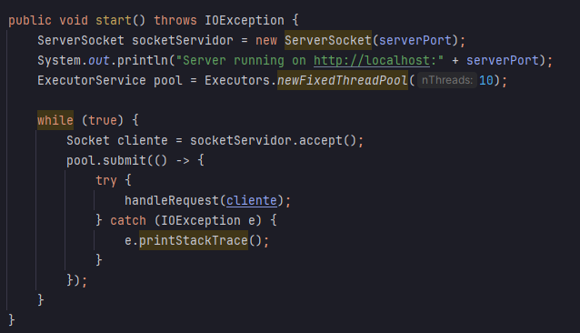
### Elegant close
- When the route is close, the application too close.
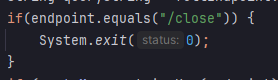
## AWS Deployment
### EC2 with java 
1. The EC2 instance is created in AWS.
2. Open the port through which the server will operate, which is 8080, go to security, and create an outbound rule on the corresponding port with TCP.
- 
3. Now we connect to the server via ssh, using the secret key created when the instance was launched.
4. We also connect to the server via sftp to transfer the compiled files for the application.
- 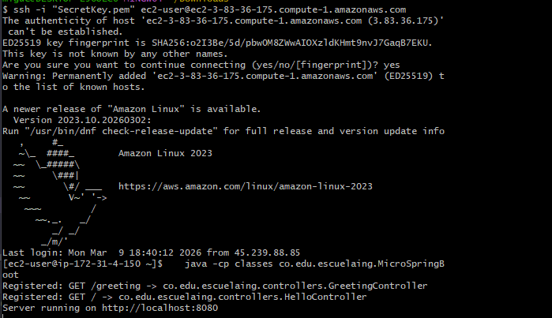
5. Once inside, we start the application with the command at the beginning of the readme and enter the application with the application's public DNS and the respective port.
- 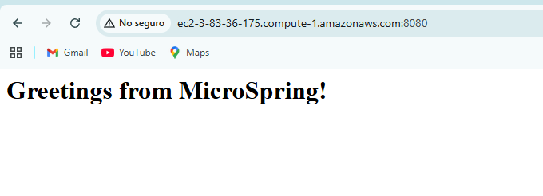
6. Finally, we tested the application.
- 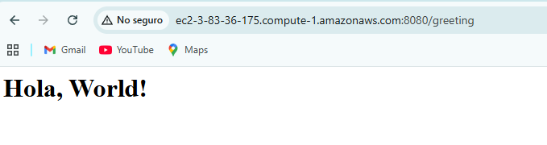
- 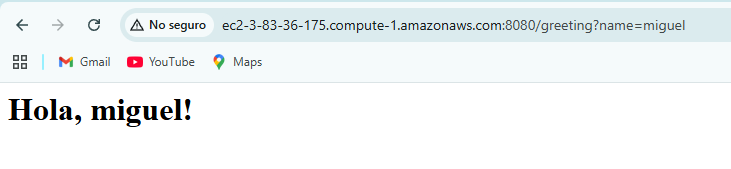
- 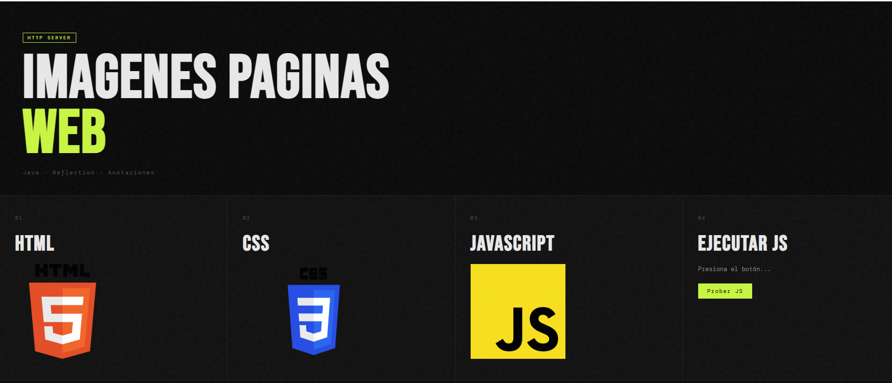
### EC2 with docker
1. Identify a command to compile and run the project, in this case is 
```bash 
  mvn clean install 
  java -cp "target/classes:target/dependency/*" co.edu.escuelaing.sparkdockerdemolive.RestServiceApplication
```
2. Create dockerFile
- 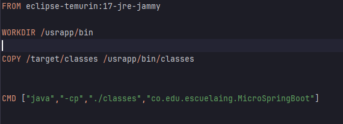
3. Create docker-compose
- 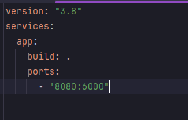
4. Execute docker-compose and valide the process is running.
```bash 
  docker-compose up -d
```
- 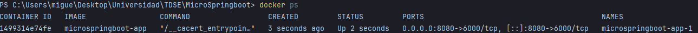
5. Create repository on dockerhub
- 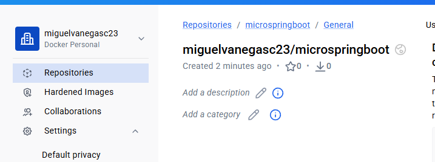
6. Create tag on local machine
```bash
  docker tag microspringboot-app miguelvanegasc23/microspringboot
```
7. Once in the EC2 instance, we log in via SSH, grant permissions to the key, and then log in to the machine
- 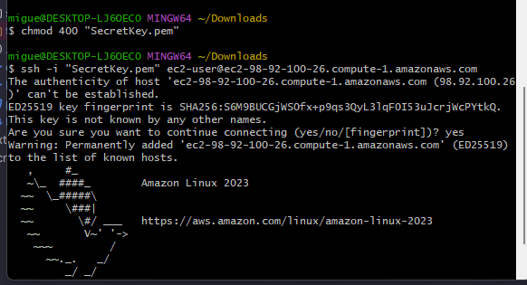
8. Install docker with:
```bash 
  sudo yum update -y
  sudo yum install docker
```
9. Start the service
- 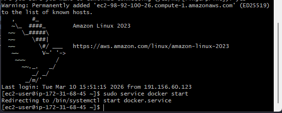
10. Configure the user in docker group.
```bash 
  sudo usermod -a -G docker ec2-user
```
11. Restart the EC2 instance.
12. Finally, using the image from the repository, a container is created on the machine with an outgoing connection on port 42000 of the EC2 instance
```bash 
   docker run -d -p 42000:6000 --name microspringboot miguelvanegasc23/microspringboot
```
13. Confirm it is running.
- 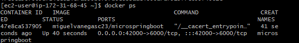

**Note:** The EC2 instance must allow TCP traffic through port 42000, which was used in this case.

## Team members
- Miguel Angel Vanegas Cardenas.

If you want to contribute or use this project as a base for your explorations in IoC in Java, follow the instructions described to build and deploy your application on an AWS EC2 instance. Enjoy exploring and learning!
