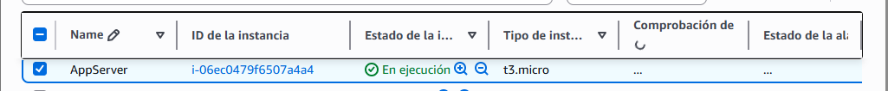
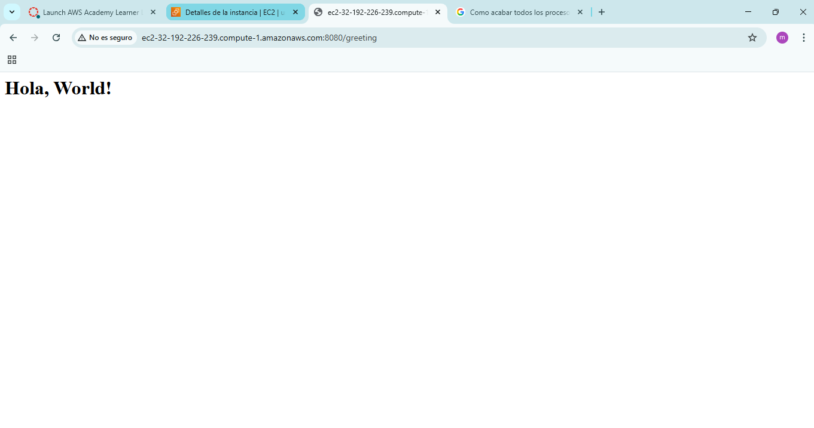
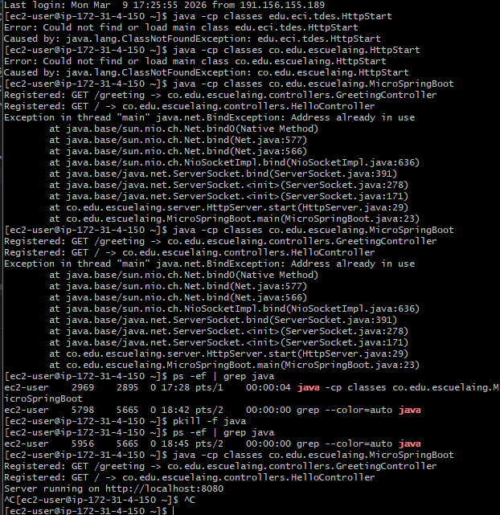
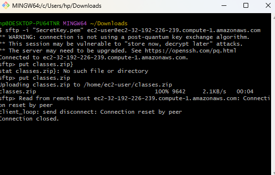

# MicroSpringboot

This project is the development of a Java Web server as part of an academic workshop. Below, the objectives and main characteristics of the project are described, as well as the steps for deployment on AWS on an EC2 instance.

## What does it need to run??
### Dependencies
> - Java 21
> - mvn 3.3.0
### How to run it
- First compile the project using
```bash
   mvn clean install
```
- Then from the project root, run the following command:
```bash
   java -cp target/classes co.edu.escuelaing.MicroSpringBoot
```
## Workshop Objectives

- **IoC Framework**: Include an inversion of control framework to allow the construction of Web applications from POJOS (Plain Old Java Objects).
- **Example application**: Create a sample web application using the server.
- **Request handling**: Enable the handling of multiple non-concurrent requests.
- **Minimal prototype**: Demonstrate Java's reflective capabilities by allowing to load a bean (POJO) and derive a web application from it.

## Project description
### Annotations
- The annotations GetMapping, RequestParam and RestController were created

- A class was declared as @interface.
- @Retention was used so that the annotation is maintained while the program is running.
- @Target was used to know which element the annotation will mark.
- Values were defined where necessary, and in one case a default value was defined in case the other value is not found.

### Controllers (POJO)
- The following controllers were created.

- Controllers were marked with the @RestController annotations
- Methods were marked with the @GetMapping annotation and an internal value that defines the route.
- A parameter was marked with @RequestParam to obtain the value of that parameter and declare a default value in case it is not found.

### HttpServer
- It stores routes, with their respective methods and instances of those marked with the @RestController and @GetMapping labels
- This class creates the connection with the browser that wants to make a request.
- It receives requests, extracts parameters and executes the corresponding methods.
- It registers methods and instances of the controllers.
### MicroSpringBoot
- Here the service of our Micro SpringBoot is started and the necessary operations for IoC are performed
> 1. 
>     - In the main method it starts the http server and follows two paths: in case a controller has been specified, it loads it directly; if not, it scans the classPath.
> 2. 
>     - This loads a controller, verifying that the specified class contains the RestController annotation, creating an instance of it and iterating over its methods looking for the getMapping annotation; upon finding it, it obtains the route value and registers it in the server.
> 3. 
>     - The method scans the classpath entirely; when entering it validates if it is a directory and if so begins its scan.
> 4. 
>     - It scans the directory recursively until it finds files; upon finding them it formats the URI to create the path of a class and load it with the loadClass method.

## Team members
- Miguel Angel Vanegas Cardenas.

If you want to contribute or use this project as a base for your explorations in IoC in Java, follow the instructions described to build and deploy your application on an AWS EC2 instance. Enjoy exploring and learning!
